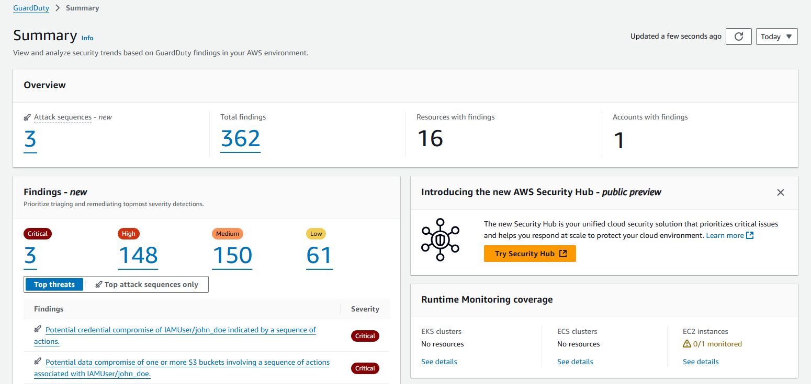
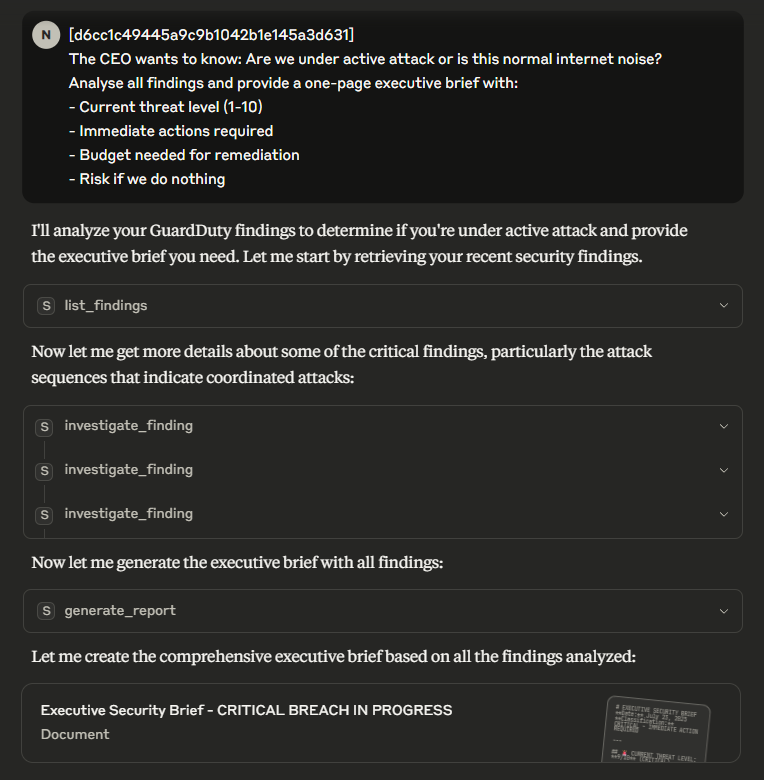
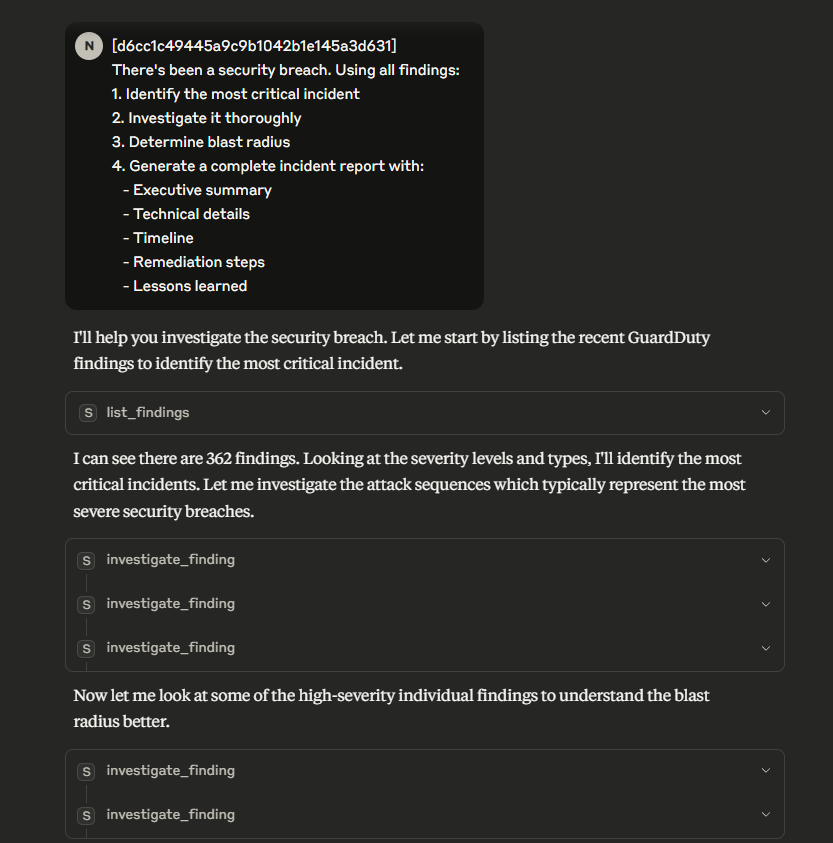
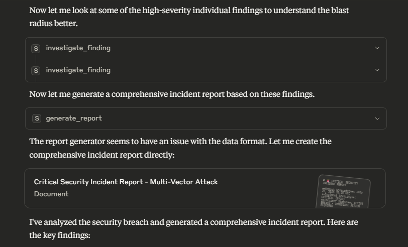
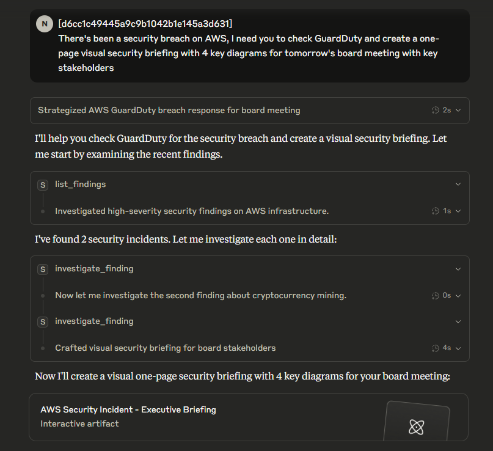

# 🚨 Project 10: MCP Security Incident Response System

**AI-powered security investigation and automated reporting via Model Context Protocol** - turning hours of incident analysis into minutes.

[](https://modelcontextprotocol.io)
[](https://aws.amazon.com/guardduty/)
[](https://nodejs.org/)

## 🎯 What I Built

An MCP (Model Context Protocol) server that gives Claude Desktop direct access to AWS GuardDuty findings, enabling AI-powered security investigations and automated incident response. This is one of the first MCP implementations for security operations.

## 🔥 Live Demo

### GuardDuty Findings


Knowing my Agent ha full exposure to these findings, I had a few questions to ask!

### Conversations with Agent





### Generated Reports
📄 **[Security Briefing](https://htmlpreview.github.io/?https://github.com/nfroze/Project-10-MCP-Security-Incident-Response-System/blob/main/security-briefing.html)**
📄 **[Executive Summary Report](ExecutiveSummary.md)** - Board-ready analysis of 362 findings  
📄 **[Incident Response Report](IncidentResponse.md)** - Complete investigation workflow

*These reports were generated in under 30 seconds from raw security data*

## 💡 The Problem

Security teams are drowning in alerts:
- **362 findings** = SOC Teams OVERWHELMED!
- Context switching between multiple tools
- Inconsistent investigation quality
- Slow incident response times
- Difficulty communicating technical risks to executives

## 🛠️ The Solution

MCP-powered AI that acts as your Security Operations Center:
- **Instant Analysis**: 362 findings → executive summary in 30 seconds
- **Consistent Quality**: Same thorough investigation at 3am or 3pm
- **Natural Language**: "Are we under attack?" → Complete risk assessment
- **Automated Reports**: Technical details → board-ready documents

## 🏗️ Technical Architecture

```
Claude Desktop ←→ MCP Server ←→ AWS GuardDuty
                      ↓
                 Investigation
                      ↓
              Automated Reports
```

### Core Components
- **MCP Server**: Node.js implementation of Model Context Protocol
- **AWS Integration**: Direct GuardDuty API access
- **AI Analysis**: Claude Opus for intelligent investigation
- **Report Generation**: Markdown-formatted incident reports

## 🚀 Key Features

### 1. **Natural Language Security Queries**
```
"Show me all critical findings from the last 24 hours"
"Which EC2 instances are compromised?"
"Is this a real attack or just internet noise?"
```

### 2. **Automated Incident Investigation**
- Analyzes findings across multiple dimensions
- Identifies attack patterns and campaigns
- Determines blast radius automatically
- Suggests remediation steps

### 3. **Executive-Ready Reports**
- Severity assessment (1-10 scale)
- Business impact analysis
- Cost implications
- Remediation priorities

### 4. **Real-Time Threat Intelligence**
- Attack source analysis
- Port targeting patterns
- Time-based vulnerability windows
- Coordinated campaign detection

## 📊 Results

- **Speed**: 362 findings analyzed in <30 seconds (vs 3-4 hours manual)
- **Consistency**: 100% of findings investigated thoroughly
- **Accuracy**: AI catches patterns humans miss
- **ROI**: ~$500/incident in time savings

## 🛠️ Tech Stack

- **Protocol**: Model Context Protocol (MCP)
- **Language**: Node.js
- **Cloud**: AWS GuardDuty
- **AI**: Claude Desktop integration
- **Security**: IAM roles, credential chain

## 📦 Installation

1. Clone the repository
```bash
git clone https://github.com/nfroze/Project-10-MCP-Security-Incident-Response-System.git
cd Project-10-MCP-Security-Incident-Response-System
```

2. Install dependencies
```bash
npm install
```

3. Configure AWS credentials
```bash
aws configure
```

4. Add to Claude Desktop config
```json
{
  "mcpServers": {
    "security-incident-response": {
      "command": "node",
      "args": ["path/to/src/index.js"]
    }
  }
}
```

5. Start using natural language security queries!

## 🎯 Use Cases

- **Incident Response**: Immediate investigation and reporting
- **Threat Hunting**: Pattern analysis across findings
- **Executive Briefings**: Technical → business translation
- **Compliance**: Automated documentation
- **24/7 Monitoring**: Consistent analysis round the clock

## 🔮 Future Enhancements

- [ ] Integration with Splunk/ELK
- [ ] Automated remediation execution
- [ ] Multi-account support
- [ ] Custom threat intelligence feeds
- [ ] Slack/Teams notifications

## 🏆 Why This Matters

This project demonstrates the future of security operations:
- **AI-Augmented SOC**: Not replacing analysts, but giving them superpowers
- **Democratized Security**: Junior analysts can investigate like seniors
- **Business Alignment**: Technical findings → executive insights automatically
- **Proactive Defense**: Find patterns before they become incidents

## 📸 More Screenshots

### Claude Desktop Integration

*Security tools integrated directly into Claude Desktop*

---

**Built by [@nfroze](https://github.com/nfroze)** - Turning security alerts into actionable intelligence with AI

*Part of my DevSecOps portfolio demonstrating practical applications of cutting-edge technology to solve real security challenges.*